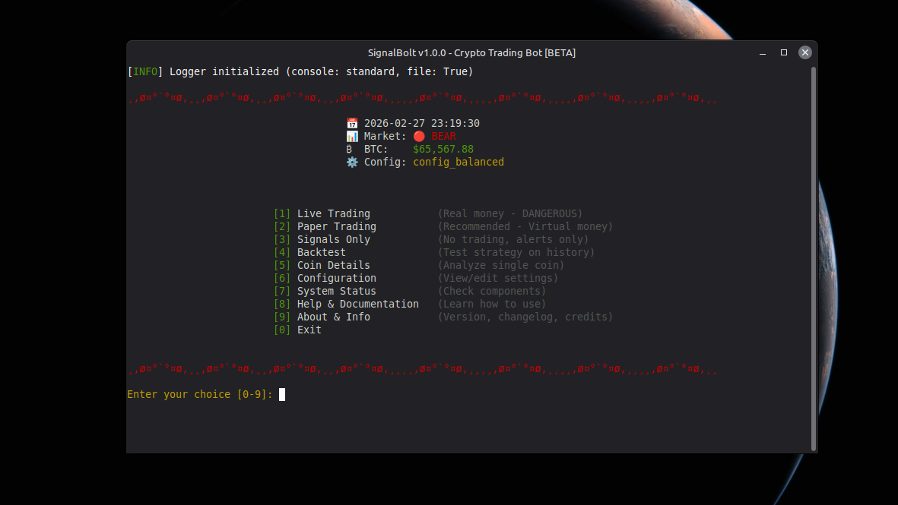

# 

[](https://www.python.org/downloads/)
[](https://opensource.org/licenses/MIT)
[](https://github.com/psf/black)
[](https://github.com/gettexik0wy/SignalBolt)

[](https://discord.gg/JWeKseJsmE)

---

> The easiest way to automate crypto trading - test strategies safely before risking real money.

## 🚀 What is SignalBolt?

SignalBolt is a crypto trading automation platform designed for **both beginners and professionals** who want to:

✅ **Test strategies safely** with paper trading (no real money)  
✅ **Trade offline** - close your laptop, come back later, see simulated results  
✅ **Get signals only** - receive notifications, trade manually  
✅ **Automate live trading** - let the bot trade for you (at your own risk)  
✅ **Backtest strategies** - validate on historical data  
✅ **Adapt to market conditions** - automatic regime detection (bull/bear/range/crash)

### 🎯 Why SignalBolt?

**The Problem:** Other bots require your computer running 24/7 for paper trading.

**SignalBolt's Solution:** **Offline Paper Trading** - Start a test, close your laptop, come back in a week. SignalBolt downloads historical data and simulates everything that would have happened.

# 
---

## ⚠️ Risk Disclaimer

**Trading cryptocurrency is extremely risky. You can lose all your invested capital.**

- This software is provided "AS IS" without warranty of any kind
- Past performance does not guarantee future results
- Backtests are simulations and may not reflect real trading
- **Never invest more than you can afford to lose**
- This is NOT financial advice

---

## ✨ Features

### Core Features (v1.0.0)

- 📝 **Paper Trading** - Test with fake money, real market data
- 🔌 **Offline Paper Trading** - Unique replay system (no 24/7 uptime needed)
- 📢 **Signals-Only Mode** - Get notifications, trade manually (zero risk)
- 🤖 **Telegram Bot** - Commands + real-time alerts
- 💬 **Discord Webhooks** - Signal notifications
- 📊 **Multiple Strategies** - SignalBolt Original, Adaptive, Scalper, Conservative, Aggressive
- 🧪 **Backtesting** - Historical validation with Monte Carlo & Walk-Forward
- 🌡️ **Regime Detection** - Auto-adapt to bull/bear/range/crash markets

### Exchanges

- ✅ Binance (spot trading)
- ⏳ More exchanges coming soon

---

## 📦 Installation

### Requirements

- Python 3.12+
- Windows or Linux
- Binance account (for live trading)

### Quick Start

```
# 1. Clone repository
git clone https://github.com/gettexik0wy/signalbolt.git
cd signalbolt

# 2. Install dependencies
pip install -r requirements.txt

# 3. Configure
cp .env.example .env
# Edit .env with your API keys (optional for live trading)

# 4. Run
python run.py

```